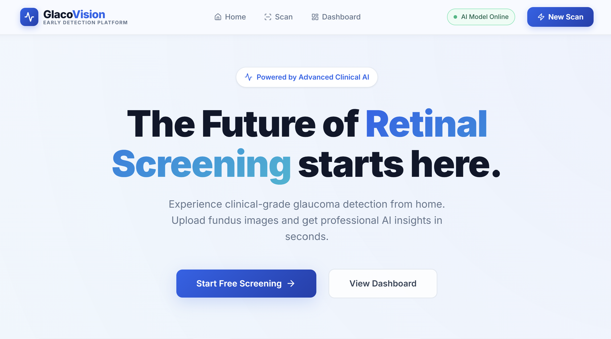
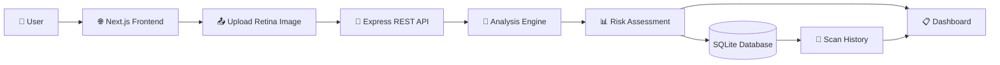

<div align="center">

# 👁️ GlaucoVision
### AI-Powered Early Glaucoma Risk Screening Platform

<p align="center">

</p>

<p align="center">


</p>

<p align="center">


</p>

## Protecting Vision Through Intelligent Early Screening

*A modern healthcare platform designed to make preliminary glaucoma risk screening faster, smarter, and more accessible through an intuitive full-stack web application.*

### 🌐 Live Links

🚀 **Live Demo**  
https://glucoma-gamma.vercel.app

💻 **GitHub Repository**  
https://github.com/RakeshKumar625/glucoma

🏆 **TechExpo IIT Guwahati Submission**

---

⭐ If you find this project useful, consider giving it a Star.

</div>

---

# 📖 Table of Contents

- Project Overview
- Why Glaucoma Matters
- Problem Statement
- Our Solution
- Key Features
- Technology Stack
- Project Architecture
- Workflow
- Analysis Pipeline
- Screenshots
- Installation
- Usage
- API Documentation
- Folder Structure
- Roadmap
- Innovation
- Real World Impact
- Contributors
- License
- Contact

---

# 🌍 Project Overview

GlaucoVision is a modern healthcare-focused web application developed to support the **early screening of glaucoma**, one of the world's leading causes of irreversible blindness.

The application enables users to upload retinal fundus images and instantly receive a structured glaucoma risk assessment through a clean, responsive dashboard.

Rather than serving as a replacement for professional diagnosis, GlaucoVision acts as an intelligent first-pass screening tool that helps identify potentially high-risk patients who should seek immediate medical evaluation.

The platform demonstrates how modern web technologies can improve healthcare accessibility, especially for remote and underserved communities where specialist consultation may not always be readily available.

---

# 👁 Why Glaucoma Matters

According to the World Health Organization, glaucoma affects millions of people worldwide and remains one of the primary causes of permanent vision loss.

The disease is particularly dangerous because:

- Symptoms usually appear very late.
- Vision loss cannot be reversed.
- Early detection significantly reduces blindness.
- Regular screening remains inaccessible for many rural populations.

These challenges inspired the development of GlaucoVision.

---

# ❗ Problem Statement

| Challenge | Impact |
|------------|---------|
| Delayed Diagnosis | Permanent vision damage before symptoms appear |
| Lack of Specialists | Rural areas often lack ophthalmologists |
| Expensive Screening | High cost of equipment and consultation |
| Accessibility Issues | Long travel distance for diagnosis |
| Manual Image Review | Time-consuming clinical workflow |

Without affordable and accessible screening, thousands of patients remain undiagnosed until vision loss has already become irreversible.

---

# 💡 Our Solution

GlaucoVision provides a complete web-based screening platform that enables users to upload retinal images directly from any browser.

The platform processes the uploaded image and returns:

- Risk Category
- Confidence Score
- Structured Medical Report
- Persistent Scan History

Unlike traditional proof-of-concept projects, GlaucoVision focuses on delivering a complete product experience including:

- Modern User Interface
- REST API Backend
- Database Integration
- Cloud Deployment
- Future-ready AI Integration

The current implementation demonstrates the complete workflow using a modular analysis engine that can later be replaced by a clinically trained deep learning model without requiring major architectural changes.

---

# ✨ Key Features

## Healthcare Features

- Retina Fundus Image Upload
- Instant Risk Assessment
- Confidence Score
- Medical Style Report
- Patient Scan History
- Structured Dashboard

## Technical Features

- Full Stack Architecture
- RESTful APIs
- SQLite Database
- Responsive Design
- Cloud Deployment
- Modular Backend
- Clean UI
- Future AI Integration

---

# 🚀 Project Highlights

- Fully deployed application
- Responsive medical dashboard
- Secure backend architecture
- Database persistence
- Modern React interface
- Express REST API
- SQLite storage
- Vercel deployment
- Modular scalable architecture

---

# 🛠 Technology Stack

| Layer | Technology |
|---------|------------|
| Frontend | Next.js 15 |
| UI Library | React 18 |
| Icons | Lucide React |
| Styling | CSS |
| Backend | Node.js |
| API | Express.js |
| Database | SQLite3 |
| Deployment | Vercel |
| Version Control | Git & GitHub |
| Future AI | TensorFlow / PyTorch (Planned) |

---

# 📊 Development Status

| Module | Status |
|---------|--------|
| Frontend | ✅ Completed |
| Backend | ✅ Completed |
| Database | ✅ Completed |
| Dashboard | ✅ Completed |
| Scan History | ✅ Completed |
| Deployment | ✅ Live |
| Authentication | Under Progress |
| CNN Model | Partially Complete |
| Explainable AI | In Progress |
| Mobile App | 🚧 Planned |

---

# 🎯 Objectives

The primary objectives of GlaucoVision are:

- Improve accessibility of preliminary glaucoma screening.
- Reduce dependency on expensive screening infrastructure.
- Demonstrate an extensible healthcare technology platform.
- Build a scalable architecture suitable for future AI integration.
- Promote preventive healthcare through digital innovation.

---

# ⚠ Medical Disclaimer

GlaucoVision is intended solely for educational, research, and prototype demonstration purposes.

The current implementation is **not a clinically validated diagnostic system** and should not be used as a substitute for professional medical advice, diagnosis, or treatment.

Always consult a qualified ophthalmologist regarding any eye-related medical concerns.

---
# 🏗️ Project Architecture

GlaucoVision follows a modular full-stack architecture that separates the presentation layer, backend services, database, and analysis engine. This design makes the application scalable, maintainable, and ready for future AI integration.



---

# 🔄 Application Workflow

The platform follows a simple and efficient workflow:

## Step 1 — Image Upload

The user uploads a retinal fundus image through the web interface.

↓

## Step 2 — Backend Processing

The frontend sends the image to the Express backend through REST APIs.

↓

## Step 3 — Analysis

The analysis layer processes the uploaded image and generates:

- Risk Category
- Confidence Score
- Structured Report

↓

## Step 4 — Database Storage

Every scan is stored in SQLite along with:

- Upload Time
- Image Name
- Risk Level
- Confidence
- Scan ID

↓

## Step 5 — Dashboard

The report is displayed instantly and becomes available inside Scan History.

---

# 🧬 Analysis Pipeline

## Current Version

The current application demonstrates the complete healthcare workflow using a modular rule-based analysis engine.

Pipeline:

```text
Retina Image

↓

Image Validation

↓

Analysis Engine

↓

Risk Calculation

↓

Confidence Generation

↓

Medical Report

↓

Database Storage

↓

Dashboard
```

---

## Future AI Pipeline

The existing architecture has been intentionally designed so that the analysis layer can later be replaced with an actual deep learning model.

Future pipeline:

```text
Retina Image

↓

Image Preprocessing

↓

Normalization

↓

Data Augmentation

↓

CNN / Vision Transformer

↓

Probability Prediction

↓

Explainable AI

↓

Risk Report

↓

Dashboard
```

---

# 🗄 Database Design

SQLite stores all scan records.

## Scan Table

| Field | Type |
|--------|------|
| id | INTEGER |
| image_name | TEXT |
| risk_level | TEXT |
| confidence | REAL |
| created_at | TIMESTAMP |

---

## Future Tables

### Users

| Field | Type |
|--------|------|
| id | INTEGER |
| name | TEXT |
| email | TEXT |
| password | TEXT |

---

### Reports

| Field | Type |
|--------|------|
| report_id | INTEGER |
| patient_id | INTEGER |
| diagnosis | TEXT |
| created_at | TIMESTAMP |

---

### Doctors

| Field | Type |
|--------|------|
| id | INTEGER |
| hospital | TEXT |
| specialization | TEXT |

---

# 🔌 REST API Documentation

## Upload Image

POST

```
/api/analyze
```

Request

```json
{
  "image":"retina.jpg"
}
```

Response

```json
{
  "risk":"Moderate",
  "confidence":"92%"
}
```

---

## Get Scan History

GET

```
/api/history
```

Response

```json
[
 {
   "id":1,
   "risk":"Low",
   "confidence":"81%"
 }
]
```

---

## Delete Scan

DELETE

```
/api/history/:id
```

---

## Health Check

GET

```
/api/health
```

Response

```json
{
 "status":"running"
}
```

---

# 📂 Folder Structure

```text
GlaucoVision/

│
├── backend/
│   ├── routes/
│   ├── controllers/
│   ├── middleware/
│   ├── database/
│   ├── uploads/
│   ├── services/
│   ├── utils/
│   ├── server.js
│   └── package.json
│
├── frontend/
│   ├── app/
│   ├── components/
│   ├── public/
│   ├── styles/
│   ├── hooks/
│   ├── utils/
│   ├── package.json
│   └── next.config.js
│
├── docs/
│   ├── banner.png
│   ├── architecture.png
│   ├── demo.gif
│   └── screenshots/
│
├── README.md
├── LICENSE
└── .gitignore
```

---

# ⚙ Installation Guide

## Clone Repository

```bash
git clone https://github.com/RakeshKumar625/glucoma.git
```

Move inside the project

```bash
cd glucoma
```

---

## Backend

```bash
cd backend

npm install

npm start
```

Backend runs at

```
http://localhost:5000
```

---

## Frontend

Open another terminal

```bash
cd frontend

npm install

npm run dev
```

Frontend runs at

```
http://localhost:3000
```

---

# 🔑 Environment Variables

Backend

```env
PORT=5000

DATABASE_URL=./database.sqlite
```

Frontend

```env
NEXT_PUBLIC_API_URL=http://localhost:5000
```

---

# ▶ Usage

1. Open the application.
2. Upload a retina fundus image.
3. Wait for processing.
4. Review the generated risk report.
5. Check confidence score.
6. View previous reports from Scan History.
7. Delete unwanted scans if required.

---

# 📸 Screenshots

Replace the placeholders below with actual screenshots before submission.

| Screen | Preview |
|---------|---------|
| Home Page | img_src/home.jpeg |
| Upload Page | img_src/Upload Page.jpeg |
| Analysis Result | img_src/Analysis.jpeg |
| History | img_src/History.jpeg |

---

# 🎥 Demo

Add a short GIF demonstrating:

- Opening the application
- Uploading an image
- Generating the report
- Viewing history
- Dashboard navigation

```text
docs/demo.gif
```

---

# 📈 Performance

## Current Version

- Fast image upload
- Lightweight backend
- Responsive interface
- Low resource usage

## Future ML Metrics

| Metric | Status |
|---------|--------|
| Accuracy | To be evaluated |
| Precision | To be evaluated |
| Recall | To be evaluated |
| F1 Score | To be evaluated |
| ROC-AUC | To be evaluated |
| Confusion Matrix | Planned |

---

# 🚀 Future Scope

GlaucoVision has been designed with scalability in mind. The current version demonstrates a complete end-to-end healthcare platform, while future versions will introduce advanced AI capabilities and clinical workflow integrations.

## Version 2.0 — AI Integration

- 🧠 CNN-based glaucoma detection model
- 📷 Automated retinal image preprocessing
- 🔍 Explainable AI using Grad-CAM
- 📊 Real clinical performance metrics
- ☁️ AI inference service deployment

---

## Version 3.0 — Clinical Platform

- 👨‍⚕️ Doctor dashboard
- 👤 Patient management system
- 🔐 Secure authentication (JWT/OAuth)
- 📄 Downloadable PDF reports
- 📈 Patient progress tracking
- 📤 Email report sharing

---

## Version 4.0 — Enterprise Healthcare

- 🏥 Hospital Management System integration
- 📡 Electronic Health Record (EHR) support
- 🌍 Multi-language interface
- 📱 Android application
- 🍎 iOS application
- ☁️ Cloud-native deployment
- 🤖 Telemedicine integration

---

# 🛣️ Project Roadmap

| Version | Status | Highlights |
|----------|--------|------------|
| v1.0 | ✅ Completed | Full-stack MVP, Dashboard, Scan History |
| v2.0 | 🚧 Planned | Deep Learning Model |
| v3.0 | 🚧 Planned | Doctor Portal & Authentication |
| v4.0 | 🚧 Planned | Mobile Apps & Cloud AI |
| v5.0 | 🔮 Vision | National Digital Health Integration |

---

# 🌟 Innovation

GlaucoVision is more than an image upload application. It demonstrates how modern web technologies and AI can work together to improve healthcare accessibility.

### Key Innovations

- 🌐 Browser-based screening platform
- 🏥 Healthcare-focused dashboard
- 🧩 Modular AI-ready architecture
- ☁️ Cloud deployment
- 📊 Structured medical reporting
- 📈 Persistent scan history
- 🔄 Future-ready AI integration

The modular architecture allows developers to replace the current analysis engine with a clinically validated AI model without redesigning the application.

---

# 🌍 Real-World Impact

## 👤 Patients

- Earlier awareness of potential glaucoma risk
- Faster access to screening
- Easy report access
- Better healthcare accessibility

---

## 👨‍⚕️ Doctors

- Preliminary screening assistance
- Reduced manual workload
- Better patient prioritization
- Digital reporting workflow

---

## 🏥 Hospitals

- Low-cost digital screening platform
- Faster patient triage
- Cloud accessibility
- Better record management

---

## 🌾 Rural Healthcare

One of the biggest motivations behind GlaucoVision is improving healthcare accessibility in underserved communities.

Potential benefits include:

- Community screening camps
- NGO healthcare initiatives
- Primary Health Centres
- Rural telemedicine support
- Awareness programs

---

# 🌐 Sustainable Development Goals

GlaucoVision contributes to multiple United Nations Sustainable Development Goals.

| SDG | Contribution |
|------|--------------|
| 🟢 SDG 3 | Good Health & Well-being |
| 🔵 SDG 9 | Industry, Innovation & Infrastructure |
| 🟣 SDG 10 | Reduced Inequalities |
| 🟠 SDG 17 | Partnerships for the Goals |

---

# 🏆 Why GlaucoVision Stands Out

## Technical Excellence

- Complete full-stack architecture
- Live deployment
- Responsive interface
- Database integration
- REST API backend
- Modular system design

---

## Engineering Approach

Instead of presenting only a machine learning notebook, GlaucoVision demonstrates an entire software product lifecycle.

It includes:

- User Experience
- Backend Engineering
- Database Design
- Deployment
- Documentation
- Future AI Integration

---

## Social Relevance

Glaucoma remains one of the leading causes of irreversible blindness.

By exploring affordable digital screening solutions, this project aims to support preventive healthcare and improve access to early risk assessment.

---

# 📊 Project Statistics

| Category | Value |
|----------|-------|
| Architecture | Full Stack |
| Deployment | Live |
| Frontend | Next.js |
| Backend | Express.js |
| Database | SQLite3 |
| Documentation | Comprehensive |
| Scalability | High |
| Open Source | Yes |

---

# 🤝 Contributors

<table>
<tr>

<td align="center">


### Rakesh Kumar

Project Lead

Backend Developer

GitHub

LinkedIn

</td>

<td align="center">


### Mukesh Kumar Bauri

Frontend & Product Development

GitHub

LinkedIn

</td>

<td align="center">


### Jigisha Diksha

UI/UX & Research

GitHub

LinkedIn

</td>

<td align="center">


### Sikha Kumari

Testing & Documentation

GitHub

LinkedIn

</td>

</tr>

</table>

---

# 🙏 Acknowledgements

We sincerely acknowledge:

- Ramgarh Engineering College
- Faculty mentors
- Open-source community
- Next.js Team
- React Team
- Express.js Team
- SQLite Developers
- Vercel
- GitHub

Special thanks to everyone contributing to accessible healthcare through technology.

---

# 📄 License

This project is licensed under the **MIT License**.

You are free to:

- Use
- Modify
- Distribute
- Contribute

Please retain the original license notice.

---

# ⚠ Medical Disclaimer

GlaucoVision is intended for educational, research, and prototype demonstration purposes only.

It is **not a clinically validated medical device** and should **not** be used as the sole basis for diagnosis or treatment decisions.

Always consult a qualified ophthalmologist for medical advice.

---

# 📬 Contact

For collaboration, feedback, or questions:

**📧 Email**

rakeshmahto625@gmail.com

**🐙 GitHub**

https://github.com/RakeshKumar625

**💼 LinkedIn**

https://linkedin.com/in/rakesh-kumar-data-science

---

# ⭐ Support the Project

If you found GlaucoVision useful:

- ⭐ Star this repository
- 🍴 Fork the project
- 🐛 Report bugs
- 💡 Suggest new features
- 🤝 Contribute through Pull Requests

Every contribution helps make digital healthcare more accessible.

---

<div align="center">

# 👁️ GlaucoVision

### Protecting Vision Through Intelligent Early Screening

**Built with ❤️ using Next.js, React, Express.js, SQLite & Open Source Technologies**

---

### "Early Detection Today. Better Vision Tomorrow."

⭐ **Thank you for visiting this repository!**

</div>
