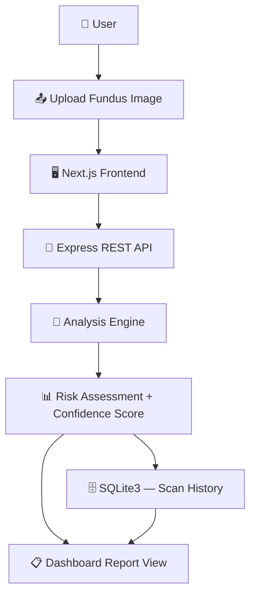

<div align="center">

# 👁️‍🗨️ GlacoVision
### AI-Assisted Early Glaucoma Screening Platform


**Catching what the eye can't see, before it's too late.**

*A full-stack web platform built to make preliminary glaucoma risk screening faster, cheaper, and more accessible — starting where healthcare access usually ends.*

[**🔴 Live Demo**](https://glucoma-gamma.vercel.app) &nbsp;•&nbsp; [**📂 Source Code**](https://github.com/RakeshKumar625/glucoma) &nbsp;•&nbsp; [**🏆 TechExpo, IIT Guwahati**](https://unstop.com/competitions/techexpo-iit-guwahati-1695273)

</div>

<div align="center">
  <em>🖼️ [Project banner placeholder — add a hero image of the dashboard here]</em>
</div>

---

## 📖 Table of Contents

- [Project Overview](#-project-overview)
- [Problem Statement](#-problem-statement)
- [Our Solution](#-our-solution)
- [Key Features](#-key-features)
- [Technology Stack](#-technology-stack)
- [Project Architecture](#-project-architecture)
- [Workflow](#-workflow)
- [Analysis Pipeline](#-analysis-pipeline)
- [Model / Analysis Performance](#-model--analysis-performance)
- [Screenshots](#-screenshots)
- [Installation Guide](#-installation-guide)
- [Usage](#-usage)
- [Folder Structure](#-folder-structure)
- [Future Scope](#-future-scope)
- [Innovation](#-innovation)
- [Real-World Impact](#-real-world-impact)
- [Why This Project Deserves Selection at TechExpo IIT Guwahati](#-why-this-project-deserves-selection-at-techexpo-iit-guwahati)
- [Contributors](#-contributors)
- [License](#-license)
- [Contact](#-contact)

---

## 🌍 Project Overview

**Glaucoma** is a group of eye conditions that damage the optic nerve, often due to abnormally high pressure in the eye. It is one of the leading causes of **irreversible blindness worldwide** — and one of the cruelest, because it is largely **asymptomatic in its early stages**. By the time a patient notices vision loss, the damage is usually permanent.

Early detection is the single biggest lever against this — but it requires:
- Regular eye screening
- Access to an ophthalmologist
- Specialized fundus imaging equipment
- Manual, expert-driven image review

In rural areas, smaller towns, and low-resource healthcare settings, one or more of these is often missing. **GlacoVision** exists to explore how a simple, web-based first-pass screening tool can lower that barrier — giving a patient or a clinic a fast, structured risk read on a retina fundus image, so specialist time gets prioritized for the people who actually need it.

## ❗ Problem Statement

| Challenge | Impact |
|---|---|
| 🕐 **Delayed diagnosis** | Glaucoma is symptomless until significant, irreversible vision loss has occurred |
| 👨‍⚕️ **Shortage of specialists** | Ophthalmologists and trained graders are concentrated in cities |
| 💰 **High screening costs** | Traditional diagnostic equipment and consultations are expensive |
| 🌾 **Lack of accessibility** | Rural and semi-urban populations often have no nearby screening option |
| 🦯 **Risk of blindness** | Glaucoma is one of the leading causes of preventable, irreversible blindness globally |

## 💡 Our Solution

GlacoVision is a **complete, deployed, full-stack web application** — not a slide-deck concept — that lets a user upload a retina fundus image and receive a structured risk report in seconds.

- ⚡ **Fast, accessible screening** — works from any browser, no special hardware
- 🖥️ **User-friendly interface** — a clean, dashboard-style medical UI, not a bare API response
- 📋 **Structured reporting** — risk level and confidence score, not a raw number
- 📊 **Persistent history** — every scan is saved so a user or clinic can track results over time

> **Transparency note:** The current build's analysis layer is a **rule-based / simulated risk engine** used to demonstrate the complete product experience end-to-end — upload → process → structured report → history. It is **not yet a trained clinical CNN model**. The system is deliberately architected (see [Analysis Pipeline](#-analysis-pipeline) and [Future Scope](#-future-scope)) so that layer can be swapped for a trained image-classification model without redesigning the frontend, backend routes, or database schema.

## ✨ Key Features

| Feature | Description |
|---|---|
| 🖼️ **Drag-and-Drop Image Upload** | Upload a retina fundus image directly from the dashboard |
| 🧪 **Instant Risk Analysis** | Get a risk read back in seconds, no waiting on manual review |
| 📈 **Confidence Scoring** | Every report includes a confidence score alongside the risk level |
| 📋 **Structured Medical Reports** | Clear Low / Moderate / High risk categorization |
| 🗂️ **Scan History Dashboard** | Every past scan persisted and viewable, per user |
| 📱 **Fully Responsive UI** | Built to work cleanly across desktop and mobile |
| ☁️ **Live Cloud Deployment** | Publicly accessible demo hosted on Vercel |
| 🧩 **Modular Architecture** | Analysis layer decoupled from frontend/backend, built for future upgrade |

## 🛠️ Technology Stack

<table>
<tr><th>Layer</th><th>Technology</th></tr>
<tr><td><b>Frontend</b></td><td>Next.js 15, React, Lucide React (icons)</td></tr>
<tr><td><b>Backend</b></td><td>Node.js, Express</td></tr>
<tr><td><b>Database</b></td><td>SQLite3</td></tr>
<tr><td><b>Analysis Layer</b></td><td>Rule-based / simulated risk engine (current) → planned CNN-based model (see Roadmap)</td></tr>
<tr><td><b>Deployment</b></td><td>Vercel (frontend + integrated app hosting)</td></tr>
<tr><td><b>Version Control</b></td><td>Git & GitHub</td></tr>
</table>

> 📌 **Placeholder:** If/when a trained ML model is added, this table should list the actual framework (e.g. TensorFlow/PyTorch), the dataset used, and any image-processing libraries (e.g. OpenCV) — currently the repository does not include a training pipeline or dataset, so these are intentionally left out rather than invented.

## 🏗️ Project Architecture



## 🔄 Workflow

1. **Upload** — The user drags and drops a retina fundus image into the web dashboard.
2. **Transmit** — The frontend sends the image to the Express backend via a REST API call.
3. **Analyze** — The backend's analysis engine processes the image and produces a risk output.
4. **Report** — A structured report (risk level + confidence score) is returned to the frontend.
5. **Persist** — The scan and its result are saved to the SQLite database.
6. **Review** — The user can revisit any past scan from their history dashboard at any time.

## 🧬 Analysis Pipeline

<details>
<summary><b>Click to expand — current vs. planned pipeline</b></summary>

**Current (demo build):**
- Image received via upload
- Simulated / rule-based risk scoring
- Output formatted into a structured report (risk level + confidence)

**Planned (see Future Scope):**
- Dataset sourcing (public fundus-image datasets, e.g. ORIGA, RIM-ONE, or similar — to be finalized)
- Image preprocessing (resizing, normalization, contrast enhancement)
- Data augmentation for class balance
- CNN-based classifier (transfer learning on a pretrained backbone)
- Train / validation / test split with proper evaluation
- Model serving layer integrated into the existing Express API

</details>

## 📊 Model / Analysis Performance

> ⚠️ **Placeholder — no trained model exists in this build yet.** The table below is a template for the metrics that should be reported once a real classifier is trained and evaluated. Publishing invented numbers here would misrepresent the project, so none are included.

| Metric | Value |
|---|---|
| Accuracy | _to be measured_ |
| Precision | _to be measured_ |
| Recall | _to be measured_ |
| F1 Score | _to be measured_ |
| AUC | _to be measured_ |
| Confusion Matrix | _to be added_ |

## 🖼️ Screenshots

> 📌 **Placeholder section** — add real screenshots/GIFs before submission. Suggested captures:

| View | Status |
|---|---|
| Landing Page | _add screenshot_ |
| Upload Page | _add screenshot_ |
| Prediction / Risk Report | _add screenshot_ |
| Scan History Dashboard | _add screenshot_ |
| About / Info Page | _add screenshot_ |
| Architecture Diagram | ✅ included above |

## ⚙️ Installation Guide

```bash
# 1. Clone the repository
git clone https://github.com/RakeshKumar625/glucoma.git
cd glucoma

# 2. Set up and start the backend
cd backend
npm install
npm start
# → runs at http://localhost:5000

# 3. In a new terminal, set up and start the frontend
cd frontend
npm install
npm run dev
# → runs at http://localhost:3000
```

No Python environment, GPU, or model weights are required to run the current build — it's a pure Node.js/Next.js stack.

## 🧑‍💻 Usage

1. Open the app at `http://localhost:3000` (or use the [live demo](https://glucoma-gamma.vercel.app)).
2. Navigate to the upload screen and drop in a retina fundus image.
3. Wait a few seconds for the risk report to generate.
4. Review the risk level and confidence score.
5. Check the dashboard anytime to revisit past scans.

## 📁 Folder Structure

```
glucoma/
├── backend/          # Node.js + Express API, SQLite3 data layer
├── frontend/          # Next.js 15 + React dashboard UI
├── .gitignore
└── README.md
```

## 🚀 Future Scope

- 🧠 Replace the simulated analysis layer with a trained CNN model (transfer learning on public fundus-image datasets)
- 📱 Native mobile application
- 🩺 Multi-disease detection (e.g. diabetic retinopathy alongside glaucoma)
- 🔍 Explainable AI overlays (highlighting the regions driving a risk score)
- 👨‍⚕️ Doctor/clinic-facing multi-patient dashboard
- 🏥 Electronic Health Record (EHR) integration
- 🔌 Public API for third-party clinic integration
- 📞 Telemedicine integration for direct specialist referral

## 🌟 Innovation

- **Healthcare accessibility** — brings a first-pass screening step to anywhere with a browser and an internet connection.
- **AI for social impact** — targets a disease where early detection is the entire game, and access is the entire bottleneck.
- **Scalable by design** — a decoupled analysis layer means the product can go from demo to a real clinical-grade tool without rebuilding the app around it.
- **Cost reduction** — a lightweight web triage step ahead of specialist review can reduce unnecessary in-person consultations.
- **Preventive-first** — built around catching risk *before* symptoms appear, not after.

## 🌍 Real-World Impact

| Stakeholder | Benefit |
|---|---|
| 🧑‍🦯 **Patients** | Faster, more accessible first-pass screening — especially where a specialist visit isn't easy to get |
| 👨‍⚕️ **Doctors** | A structured pre-screen that helps prioritize which patients need urgent review |
| 🏥 **Hospitals & Clinics** | A lightweight triage layer that can sit ahead of in-person diagnostics |
| 🤝 **NGOs & Public Health Programs** | A low-cost tool that could support outreach screening camps |
| 🏛️ **Government Healthcare Systems** | Aligns with preventive-healthcare and digital-health initiatives |
| 🌐 **UN SDGs** | Supports **SDG 3: Good Health & Well-Being**, and touches on **SDG 10: Reduced Inequalities** in healthcare access |

## 🏆 Why This Project Deserves Selection at TechExpo IIT Guwahati

- **Genuine technical execution** — a real, deployed, full-stack application with a working frontend, backend, database, and live public demo — not a concept slide.
- **Honest, extensible engineering** — the current build is transparent about being a demo-stage analysis engine, backed by an architecture explicitly designed to plug in a real trained model next, which shows engineering maturity rather than overclaiming.
- **Real-world social relevance** — targets preventable blindness in an underserved population, directly aligned with accessible, preventive healthcare.
- **Scalability** — the modular design (frontend / backend / analysis layer / database) supports a clear growth path from prototype to a genuinely deployable clinical-support tool.
- **Clear, credible roadmap** — the future scope isn't vague ambition; it's a concrete, sequenced set of next steps (dataset → model → explainability → clinical dashboard).

## 👤 Contributors

<table>
<tr>
<td align="center">
<a href="https://github.com/RakeshKumar625">
<b>Rakesh Kumar</b>
</a><br />
B.Tech in Computer Science & Engineering <br />
Ramgarh Engineering College<br />
<a href="https://github.com/RakeshKumar625">GitHub</a> · <a href="https://linkedin.com/in/rakesh-kumar-data-science">LinkedIn</a>
</td>
</tr>
</table>

## 📄 License

This project is licensed under the **MIT License**.
*(Placeholder — add a `LICENSE` file to the repository root to make this official.)*

## 📬 Contact

For questions, collaboration, or feedback on GlacoVision:

- 📧 Email: rakeshmahto625@gmail.com
- 💼 LinkedIn: [linkedin.com/in/rakesh-kumar-data-science](https://linkedin.com/in/rakesh-kumar-data-science)
- 🐙 GitHub: [github.com/RakeshKumar625](https://github.com/RakeshKumar625)

---

<div align="center">

⭐ **If you find this project interesting, consider starring the repository!** ⭐

</div>
